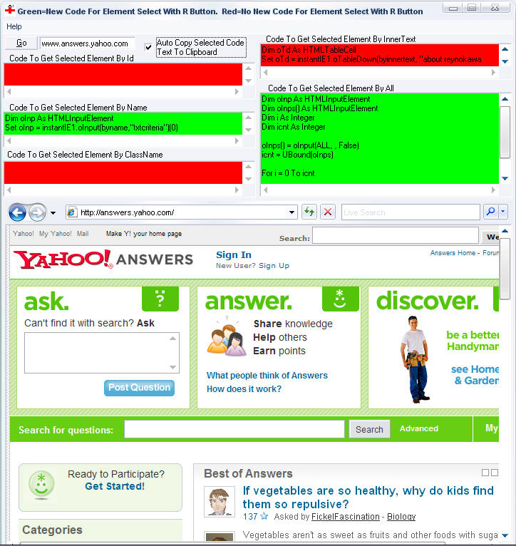



## Web Page Document Dissector And Coder Friend

### Description

This utility serves two purposes. By setting property [Control_Mode] to (user_mode) this control basically serves as a web browser with lots of additionally functionality

when it comes programming web pages. There numerous methods

and events that allow you to access elements of the webpage such as its anchors and textboxes, returning each of them, seperately, as a collection. This control gives you the

ability to easily, with 1 - 3 lines of code, get a handle on almost any element in the webpage based upon its .id, .name .classname, or innertext. So if you wanted to created a webbased application that automatically navigates to the yahoo email webpage fills in the username and password and clicks the submit button for you automatically this control gives you the ability to do that in a hassle free way. By setting property [Control_Mode] to (code_mode) you can easily and quickly get the code necessary to get the handle to each of the webpages elements so you can manipulate them i.e. the above example given with yahoo. The way you do that is this. Using the above example, after setting the [Control_Mode] to (code_mode) navigate to the yahoo login page, right click the username textbox and in this forms textboxes the code necessary to access and manipulate that element is immediately present via the username textboxes .id, .name, .classname, and .innertext properties. Click on the textbox that has the code you want and it automatically copies it to the clipboard for you. I not only welcome but strongly suggest ideas for improving this control. With all the webpage programming I do I finally got tired of all the same code I had to write over and over again to access and manipulate a webpages elements and the creation of this code/control is one of the best, most time saving utilites I have ever created and I hope you feel the same. There is very little documentation when it comes to programming and manipulating webpages and its underlying document so I feel this control would be very very helpful to lots of coders here. Your voting will tell me how it is and your suggestions and comments will help me make it even better!!"
 
### More Info
 

             |
---                |---
**Submitted On**   |2008-02-28 15:27:44
**By**             |[David Breau](https://github.com/Planet-Source-Code/PSCIndex/blob/master/ByAuthor/david-breau.md)
**Level**          |Intermediate
**User Rating**    |5.0 (25 globes from 5 users)
**Compatibility**  |VB 5\.0, VB 6\.0
**Category**       |[Complete Applications](https://github.com/Planet-Source-Code/PSCIndex/blob/master/ByCategory/complete-applications__1-27.md)
**World**          |[Visual Basic](https://github.com/Planet-Source-Code/PSCIndex/blob/master/ByWorld/visual-basic.md)
**Archive File**   |[Web\_Page\_D2103982282008\.zip](https://github.com/Planet-Source-Code/david-breau-web-page-document-dissector-and-coder-friend__1-70172/archive/master.zip)

